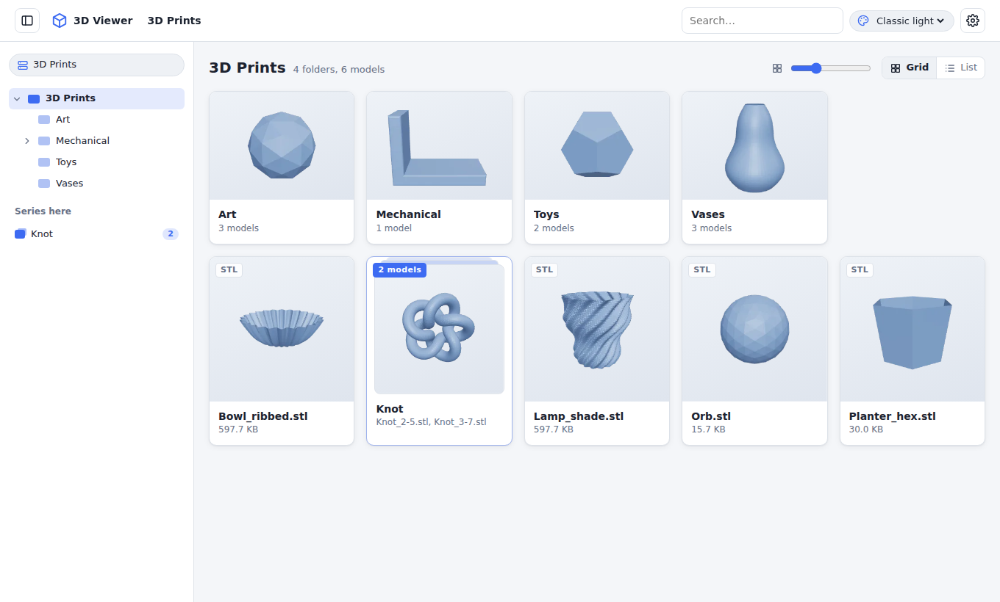
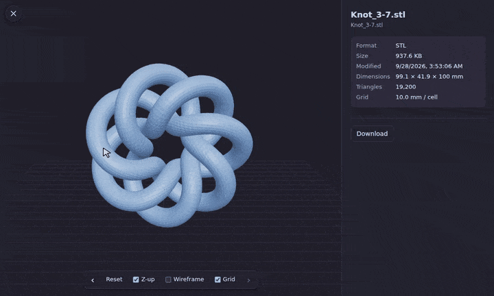
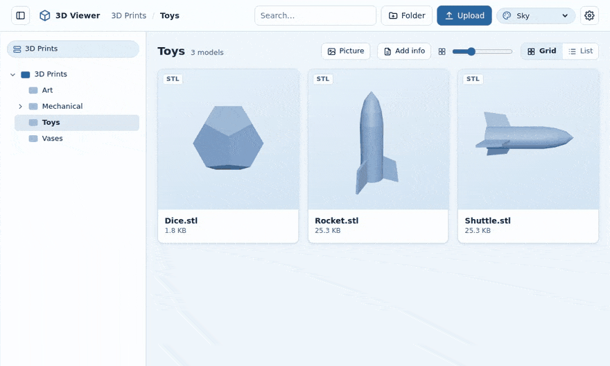
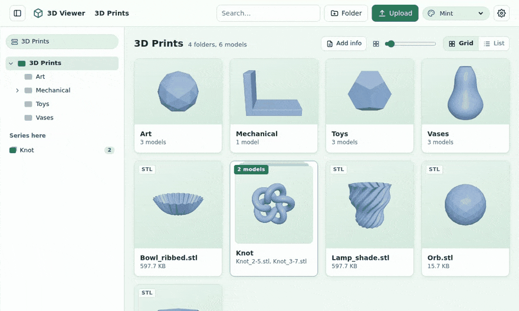
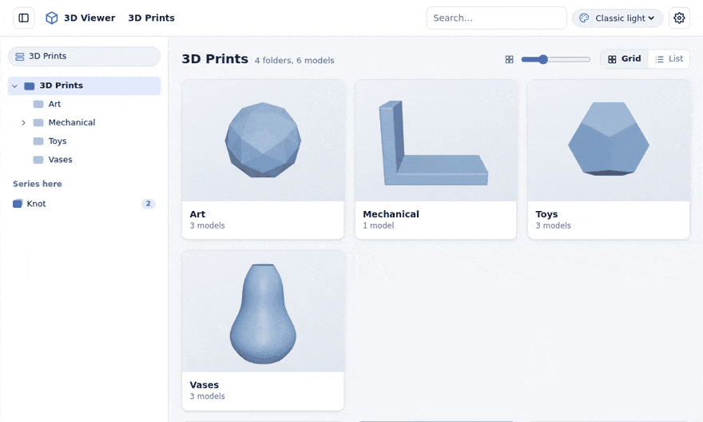

<p align="center">
  
</p>

<h1 align="center">3D Viewer</h1>

<p align="center"><b>Browse, preview and organise the 3D models on your NAS or server, from any device.</b><br>
Self-hosted with Docker · STL, 3MF, OBJ, PLY, GLB/GLTF, FBX · Free<br>
Tested on <b>UGREEN</b>, <b>Synology</b> and <b>QNAP</b> NAS</p>

<p align="center">
  <a href="#install"></a>
  <a href="https://3dview.ittechshop.com"></a>
  <a href="https://buymeacoffee.com/vincentflagg"></a>
  <a href="https://short.ittechshop.com/wyiCyr"></a>
  <a href="https://github.com/VincentFlagg/3DViewer/releases/latest"></a>
</p>

## ❤️ Free for everyone, supported by you

> **3D Viewer is free. You never need to pay to use it: every feature works without a supporter key.**
>
> If you want to support our software, please make a donation of **$5**, more or less if you feel like it. Every donation, big or small, helps keep 3D Viewer growing, and it truly means a lot. **Thank you!** 🙏
>
> As a thank-you, each donation comes with a supporter key that turns off the short daily splash screen and the small reminder in the corner. Donate with PayPal or a card at [**3dview.ittechshop.com**](https://3dview.ittechshop.com), or [**buy me a coffee**](https://buymeacoffee.com/vincentflagg): a coffee gets a key too, emailed to the address you use on Buy Me a Coffee. Paste the key in **Admin → Supporter license**; it covers everyone using that server, works offline and never expires.

## See it in action

**Turn any model around**: orbit, pan and zoom, right in the browser.



**Browse and search**: folders, series of related models, folder notes and live search.


**Fix models that lie on their side**: turn once, save, and the thumbnail follows. The model file is never changed.



**Organise**: drag models into folders, upload a .zip (it unpacks into its own folder) and choose each folder's picture.



**Pick a theme**: Auto, Classic light and dark, Mint, Lavender, Peach, Sky and Dusk.



## 🎁 Free STL files

Want some models to try it out? Free STL files are available at [**short.ittechshop.com/wyiCyr**](https://short.ittechshop.com/wyiCyr). Download them into one of your libraries and they appear in 3D Viewer straight away.

## Features

- **Libraries.** Add as many folders as you like: shares on different volumes, USB drives and so on. Switch between them from the menu at the top of the sidebar.
- **Sidebar.** A folder tree of the library (expand folders in place, the current one is highlighted) and the series in the current folder. Hide it with the button at the left of the top bar; on phones it opens as a drawer.
- **Gallery.** A grid or list of every model, with folder navigation and search (by file name, display name, description or series). A slider sets the card size. Folders show a picture: a `cover`, `folder` or `preview` image inside them, else their first image (also from an `images/` sub-folder), else the thumbnail of the model chosen with **Use as the folder thumbnail** in the viewer, else the render of their first model. A folder's own picture always wins over a model thumbnail. A folder that only holds sub-folders (for example `Bird/With base` and `Bird/No base`) shows the picture of its first sub-folder that has one.
- **Folder pictures.** Admins set any folder's picture with the picture button on its card (or **Picture** above the grid when inside it): upload one, or pick a picture or model thumbnail from inside the folder or its sub-folders. It is saved in the folder as `cover.jpg` (or `.png`, `.gif`, `.webp`), replacing an earlier `cover.*`; **Remove** deletes it and the folder goes back to the automatic picture.
- **Pictures and covers.** Images next to your models (PNG, JPG, WebP, GIF, AVIF) are used as covers: `benchy.jpg` becomes the cover of `benchy.stl`. In the viewer you can pick any picture in the folder as the cover, or go back to the 3D render. The viewer also shows a strip of the model's pictures (images named after it, and images named after no model, such as a download's `images/` folder); click one to open it full size. Large pictures get a small cached copy for the grid.
- **Moving.** Admins drag a model, a series card or a folder onto a folder card, a folder in the sidebar tree or a breadcrumb link to move it there. A model takes its notes, cached thumbnail and same-name companions (an OBJ's `.mtl`, `benchy.jpg`, `benchy.txt`) along.
- **Info panel.** A folder's `README.txt`, `notes.md` and other `.txt`/`.md` files show in a panel on the right (Markdown is formatted); a `files/` folder also shows the README of the folder above it. Notes named after a model (`benchy.txt`) show in that model's viewer panel. Admins can edit these files or add a `README.md` to any folder with **Add info**.
- **Zip files.** Uploading a `.zip` unpacks it into a new folder named after it (a single top-level folder inside the zip is dropped) and removes the zip. A zip that cannot be unpacked is kept as it is.
- **Viewer.** Models open Z-up, seen from the front; thumbnails use the same view. If a model still lies on its side or faces away, admins turn it with **Tilt**, **Turn** and **Roll** (quarter turns) in the viewer panel and **Save orientation**: it then always opens that way and its thumbnail is rendered again. The orientation is stored in the model's `.3dviewer` metadata; the model file itself is never changed. Orbit, pan and zoom, with a Z-up toggle, wireframe, a ground grid and reset view. It shows dimensions and the triangle count.
- **Series / groups.** Models whose names share a first word (`Dragon_head.stl`, `Dragon_body.stl`, `dragon-wing-L.stl`) are grouped into one stacked card automatically. You can rename a group, ungroup it, move a model into any group (one click opens a searchable list of the folder's groups, where you can also type a new name), or exclude a model from grouping. To choose which model's picture a series card shows, open that model and click **Use as the series thumbnail**.
- **Fast thumbnails and previews.** The server renders every thumbnail in the background with a headless browser, on the GPU when one is passed to the container and on the CPU otherwise. Large models also get a compressed preview (welded and meshopt-compressed GLB, often 10–20× smaller) that the viewer loads instead of the original. Downloads always give you the original file.
- **Themes.** Pick a colour theme from the palette menu in the top bar: Auto (follows your system's light/dark setting), Classic light, Classic dark, the pastel Mint, Lavender, Peach and Sky themes, or Dusk (pastel accents on a dark background). The choice is saved in your browser.
- **Admin page** (`/admin`, password protected):
  - Libraries: add, rename, change the folder, reorder, remove.
  - Network shares: connect SMB/NFS shares on other NAS devices or computers and use them as libraries.
  - Thumbnails and previews: renderer status (GPU or CPU), queue, cache size, render missing, clear the cache.
  - Viewer defaults: model color, units (mm / in), which formats are Z-up, automatic grouping on or off.
  - Access: turn editing on or off, change the admin password.
- **Viewing is open to everyone. Changes need the admin login:** upload, new folder, delete, and editing names, descriptions and groups.
- Names, descriptions and groups are stored next to each model in a `.3dviewer/` folder:
  ```
  Prints/
  ├── benchy.stl
  └── .3dviewer/
      └── benchy.stl.json   { "title": "...", "description": "...", "group": "..." }
  ```

## Tested platforms

3D Viewer is tested on the following NAS systems. It also runs on any Linux server or PC with Docker (amd64 or arm64).

| NAS | Operating system | Install with | Where your files are |
|---|---|---|---|
| **UGREEN** (DXP series) | UGOS Pro | Docker app or Dockhand (Compose project) | `/volume1`, `/volume2`, …; USB drives in `/mnt/@usb`; remote folders in `/mnt/@remote` |
| **Synology** | DSM 7.2 or later | Container Manager → **Project** | `/volume1`, `/volume2`, …; USB drives in `/volumeUSB1/usbshare` |
| **QNAP** | QTS 5 / QuTS hero | Container Station → **Applications** | `/share/<shared folder>` (add `/share` to the volumes and `BROWSE_ROOTS`, see below) |

GPU-accelerated thumbnail rendering works on models with an Intel CPU (they provide `/dev/dri`). Other models render on the CPU.

<a id="install"></a>
## Install with Docker Compose

The image `ghcr.io/vincentflagg/3dviewer:latest` runs on amd64 and arm64. Download [**docker-compose.yml**](docker-compose.yml), or copy it from here:

```yaml
services:
  3dviewer:
    image: ghcr.io/vincentflagg/3dviewer:latest
    container_name: 3DViewer
    ports:
      - "8733:3000"
    environment:
      - PORT=3000
      - PUID=${PUID:-1000}
      - PGID=${PGID:-1000}
      - BROWSE_ROOTS=${BROWSE_ROOTS:-/volume1,/volume2,/volume3,/volume4,/mnt/@usb,/mnt/@remote}
      - ADMIN_PASSWORD=${ADMIN_PASSWORD:-}
      - SESSION_COOKIE_SECURE=${SESSION_COOKIE_SECURE:-false}
      - READ_ONLY=${READ_ONLY:-false}
    cap_add:
      - SYS_ADMIN
      - DAC_READ_SEARCH
    security_opt:
      - apparmor:unconfined
    devices:
      - /dev/dri:/dev/dri
    volumes:
      - /volume2/docker/3dviewer/data:/app/data
      - /volume1:/volume1
      - /volume2:/volume2
      - /mnt/@usb:/mnt/@usb:rslave
      - /mnt/@remote:/mnt/@remote:rslave
    healthcheck:
      test: ["CMD", "node", "/app/healthcheck.js"]
      interval: 30s
      timeout: 10s
      start_period: 60s
      retries: 3
    restart: unless-stopped
```

1. Create a new Compose project and paste the file: **Dockhand** or the **Docker** app on UGREEN, **Container Manager → Project** on Synology, **Container Station → Applications** on QNAP. Change the `/app/data` volume to a folder that exists on your NAS (for example `/volume1/docker/3dviewer/data`, or `/share/Container/3dviewer/data` on QNAP), then deploy.
2. Open `http://<nas-ip>:8733/admin` and create the admin password. (Or set `ADMIN_PASSWORD` in the stack's environment; that also resets a forgotten password.)
3. Click **Add library**, then browse or search for the folder that holds your models and click **Use this folder**. Repeat for each share or drive.
4. Open `http://<nas-ip>:8733` to browse the library. Thumbnails appear as the server renders them. The Admin page shows the progress.

### Synology and QNAP notes

- **Synology:** keep the `/volume1`, `/volume2` lines that match your volumes and remove the `/mnt/@usb` and `/mnt/@remote` lines (they are UGREEN paths). For USB drives, add `- /volumeUSB1:/volumeUSB1:rslave` and add `/volumeUSB1` to `BROWSE_ROOTS`.
- **QNAP:** shared folders live under `/share`. Replace the volume lines with `- /share:/share:rslave`, set `BROWSE_ROOTS=/share`, and remove the `/mnt/@usb` and `/mnt/@remote` lines. USB drives also appear under `/share` (for example `/share/USBDisk1`).
- **Permissions:** set `PUID` and `PGID` to the user that owns your model folders (run `id <username>` over SSH). On Synology the first user is usually `1026:100`; on QNAP the admin user is `0:0` and regular users start at `500:100`.
- If the container won't start because of `/dev/dri`, remove the `devices` lines: the model has no GPU device and renders on the CPU instead.

### Network shares

- Connect the share on the NAS first. In UGOS, add it as a remote folder in the **Files** app (SMB/NFS/WebDAV). UGOS mounts remote folders under `/mnt/@remote/…`.
- The `/mnt/@remote:/mnt/@remote:rslave` volume passes every remote folder into the container, including ones connected later.
- On the Admin page, click **Add library** and search or browse for it. Remote folders show with a readable name such as **SMB · 192.168.0.74**.
- If a remote NAS is offline, its library shows **Folder not found** until it's back.

**Or connect shares directly in 3D Viewer** (Admin → **Network shares** → **Add share**):
- Enter SMB (Windows / NAS share) or NFS details: host or IP, share name or export path, and a username and password (SMB). You can also pick a protocol version and read-only. The app mounts the share and can add it as a library in one step.
- Shares reconnect automatically when the container starts and are retried every 5 minutes, for example if the other NAS was still booting. The Admin page shows the status (Connected / Not connected with the reason) and has Connect, Disconnect, Edit and Remove buttons.
- How it works: the container starts a small root helper that only mounts and unmounts shares; the web app itself runs as `PUID:PGID`. This needs `cap_add: SYS_ADMIN` and `DAC_READ_SEARCH` plus `security_opt: apparmor:unconfined`.
- **Security note:** `SYS_ADMIN` is a broad privilege. If you only use shares connected in UGOS, remove the `cap_add` and `security_opt` lines, or set `DISABLE_REMOTE_MOUNTS=true`.
- Passwords are stored in `/app/data/config.json`, readable only by the app user. At mount time they are passed through a temporary credentials file, not on the command line.

### External / USB drives

- UGREEN's UGOS usually mounts USB drives under `/mnt/@usb/<device>` (for example `/mnt/@usb/sdc1`). To confirm the path, SSH into the NAS and run `ls /mnt/@usb`.
- The `/mnt/@usb:/mnt/@usb:rslave` volume makes every connected drive visible to the app. Thanks to `rslave`, drives plugged in later show up without restarting the container. Add a drive's folder as a library on the Admin page.
- Libraries on a drive that is unplugged show **Folder not found** on the Admin page until the drive is back.
- For any other location, add a volume with the same path on both sides, for example `- /volume3:/volume3`, and make sure the path is in `BROWSE_ROOTS`. `/volume1`–`/volume4` are already listed, and volumes that aren't mounted are ignored.
- On a Synology NAS, USB drives are under `/volumeUSB1/usbshare`; on a QNAP NAS, under `/share` (for example `/share/USBDisk1`).

### GPU rendering

- With `devices: - /dev/dri:/dev/dri`, the renderer tries the GPU first (Vulkan, then OpenGL ES through Mesa). If neither works, it falls back to the CPU (SwiftShader). The Admin page shows which one is in use and the GPU's name.
- UGREEN DXP, Synology and QNAP models with an Intel CPU (for example N100, Celeron J4125, i3/i5) expose `/dev/dri`.
- If the container fails to start with an error about `/dev/dri`, your NAS has no GPU device: remove the `devices` lines.
- `RENDER_GPU=off` forces CPU rendering. `RENDER_GPU=force` accepts a software GPU.

### Updating

Every version is listed on the [**Releases**](https://github.com/VincentFlagg/3DViewer/releases) page with what changed (also in the [CHANGELOG](CHANGELOG.md)). `:latest` always has the newest version; to stay on one version, use its number instead, for example `ghcr.io/vincentflagg/3dviewer:1.0.0`.

Pull the new image and redeploy the project in Dockhand, Container Manager or Container Station, or run `docker compose pull && docker compose up -d`, then hard-refresh your browser (Ctrl+Shift+R, or Cmd+Shift+R on a Mac). Your libraries, settings, notes and thumbnails are kept.

## Configuration

| Variable        | Default          | Description                                                   |
|-----------------|------------------|---------------------------------------------------------------|
| `PORT`          | `3000`           | Port the server listens on inside the container.              |
| `PUID` / `PGID` | `1000` / `1000`  | User and group the app runs as, and the owner of the files it writes. They need write access to your libraries for uploads and notes. |
| `BROWSE_ROOTS`  | `/volume1…4,/mnt,/media,/models,/data` (the ones that exist) | Folders the Admin page may browse when adding libraries. |
| `ADMIN_PASSWORD`| unset            | Sets the admin password at startup (also resets a forgotten one). |
| `SESSION_COOKIE_SECURE` | `false`  | Set to `true` when serving over HTTPS.                        |
| `READ_ONLY`     | `false`          | `true` locks all changes (upload, delete, editing), even for the admin. |
| `MAX_UPLOAD_MB` | `1024`           | Maximum size of an uploaded file.                             |
| `MAX_UNZIP_MB`  | `8192`           | Maximum unpacked size of an uploaded zip file.                |
| `MAX_RENDER_MB` | `1024`           | Files larger than this are not rendered on the server.        |
| `RENDER_GPU`    | `auto`           | `auto`, `off` (CPU only) or `force`.                          |
| `DISABLE_SERVER_RENDER` | `false`  | Turns off the server renderer completely; browsers render thumbnails instead. |
| `DISABLE_REMOTE_MOUNTS` | `false`  | Turns off the root mount helper (no Network shares on the Admin page). |
| `AUTH_USER` / `AUTH_PASS` | unset  | Optional HTTP basic auth in front of the whole site.          |
| `MODELS_DIR`    | unset            | Optional folder added as the first library on first start.    |
| `DATA_DIR`      | `/app/data`      | Settings (`config.json`), thumbnails and previews.            |

Libraries, viewer defaults and the other settings are changed on the Admin page and stored in `/app/data/config.json`.

## Notes

- Every format opens Z-up by default. You can change this on the Admin page, per model in the viewer toolbar, or save a model's orientation in the viewer.
- Dimensions assume the model is in millimetres, as is standard for 3D printing. Choose inches on the Admin page to convert them.
- For OBJ files, the matching `.mtl` file and any textures must be in the same folder, as the OBJ's `mtllib` line names them. GLTF files need their `.bin` and texture files in the same way.
- Files and folders whose names start with `.` or `@` are hidden, which also hides NAS system folders such as `@eaDir`. `#recycle` folders are hidden too.

## License

3D Viewer is **freeware**: free to use, all rights reserved. You may run the official Docker image on as many of your own machines as you like, for personal or business use. You may not copy, modify, redistribute, resell or reverse engineer it, or remove the supporter splash or reminder. The full terms are in [LICENSE](LICENSE). Third-party components included in the image keep their own licenses.
